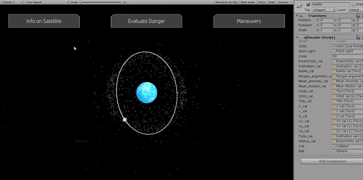
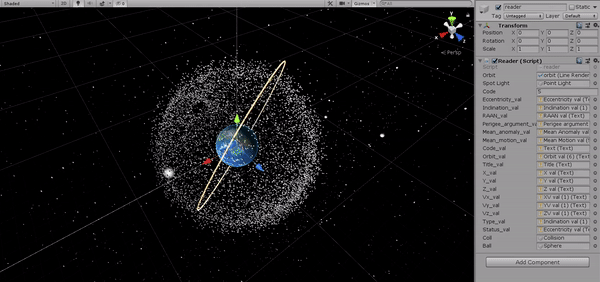

# Satellite Collision Avoidance GUI
Developed an API that serves as a centralized database of space objects and alerts the user of possible future collisions with debris or other satellites

Collision Avoidance Tool, based on TLE data from Celestrak, proposes reliable and accurate predictions on possible future collisions and strategies for collision avoidance maneuvers, are considered a problem for the NewSpace industry. 

